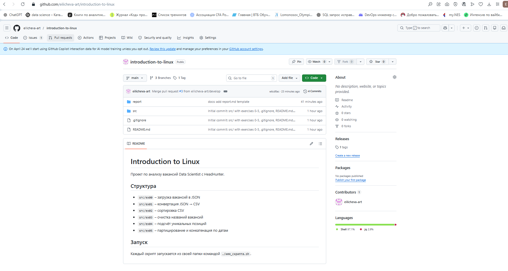
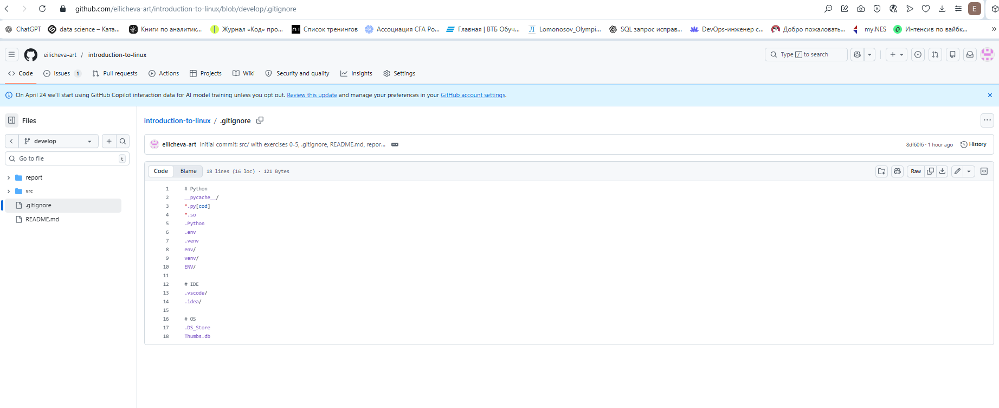
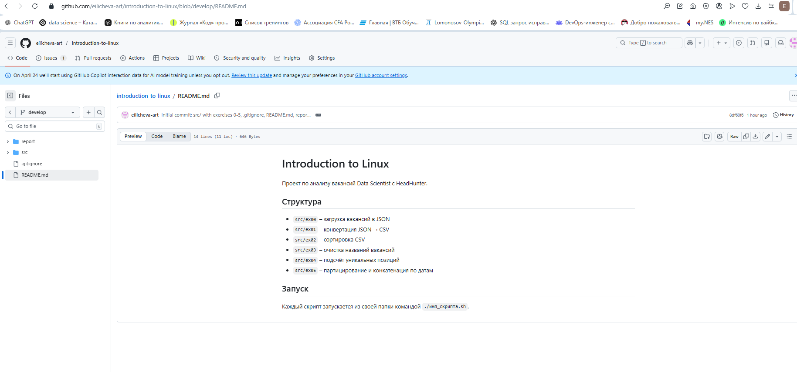
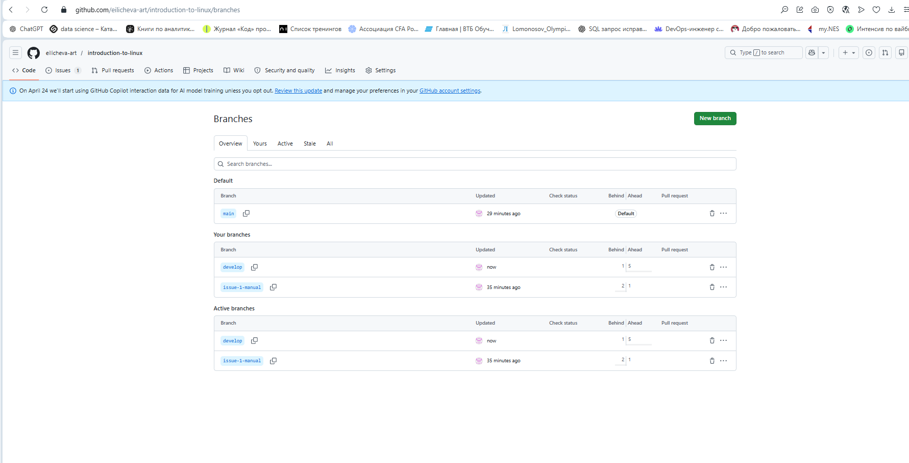
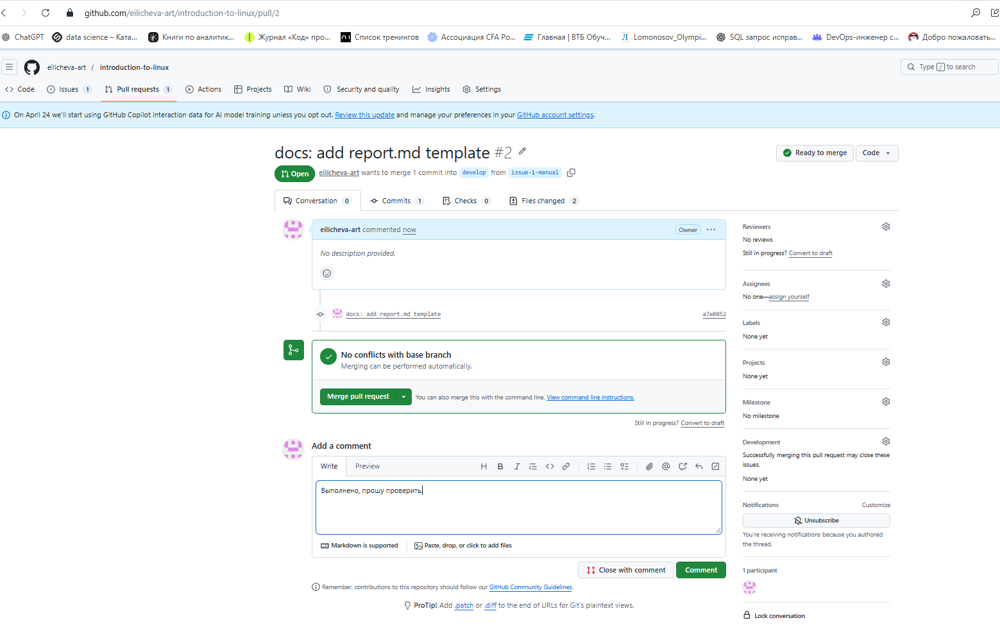
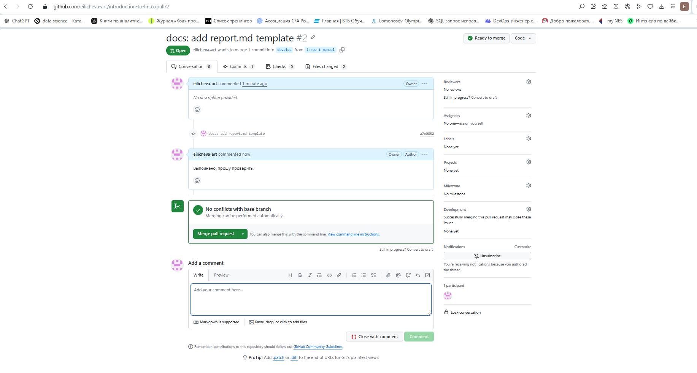
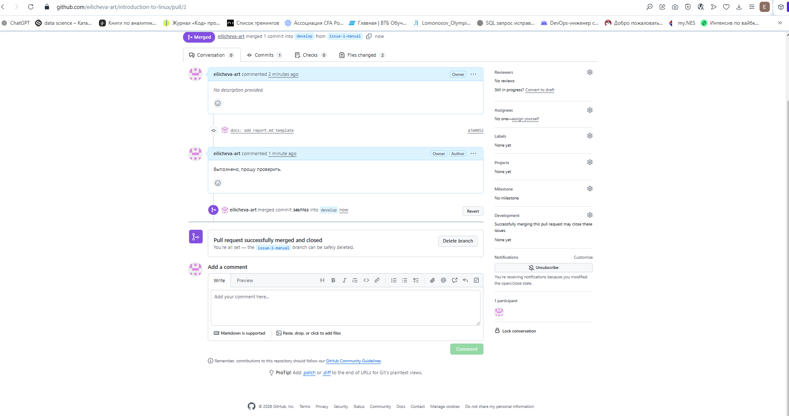
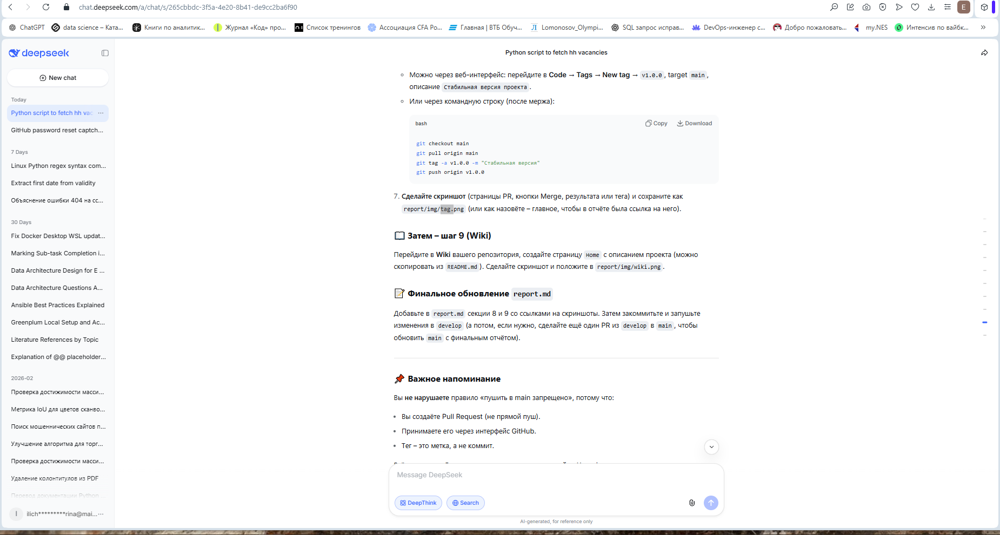
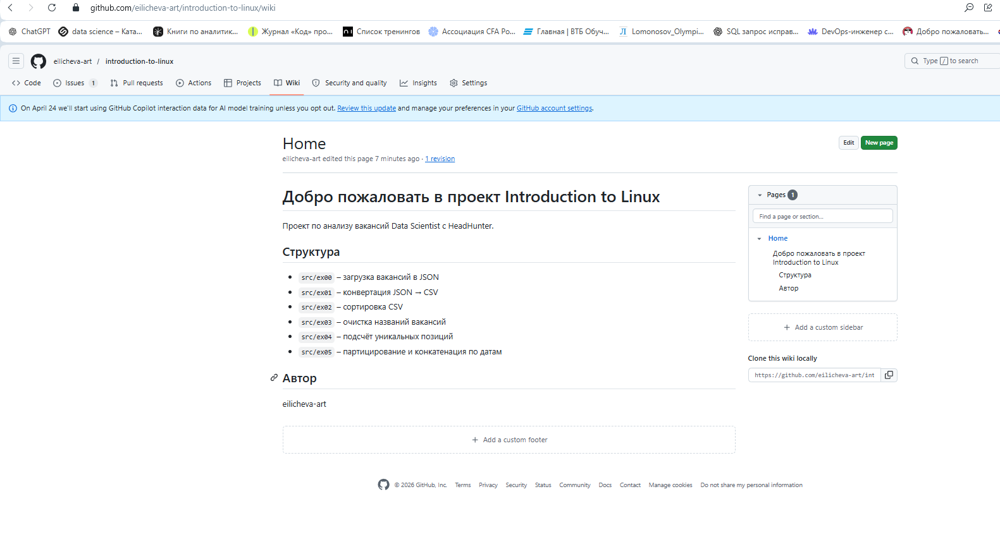

# Отчёт по работе с Git (задание 6)

## 1. Создание личного репозитория с .gitignore и README.md

## 2. Создание веток develop и master

## 3. Установка ветки develop по умолчанию

## 4. Создание issue на создание текущего мануала

## 5. Создание ветки по issue

## 6. Создание merge request по ветке в develop

## 7. Комментирование и принятие реквеста

## 8. Формирование стабильной версии в master с простановкой тега

## 9. Работа с wiki проекта

